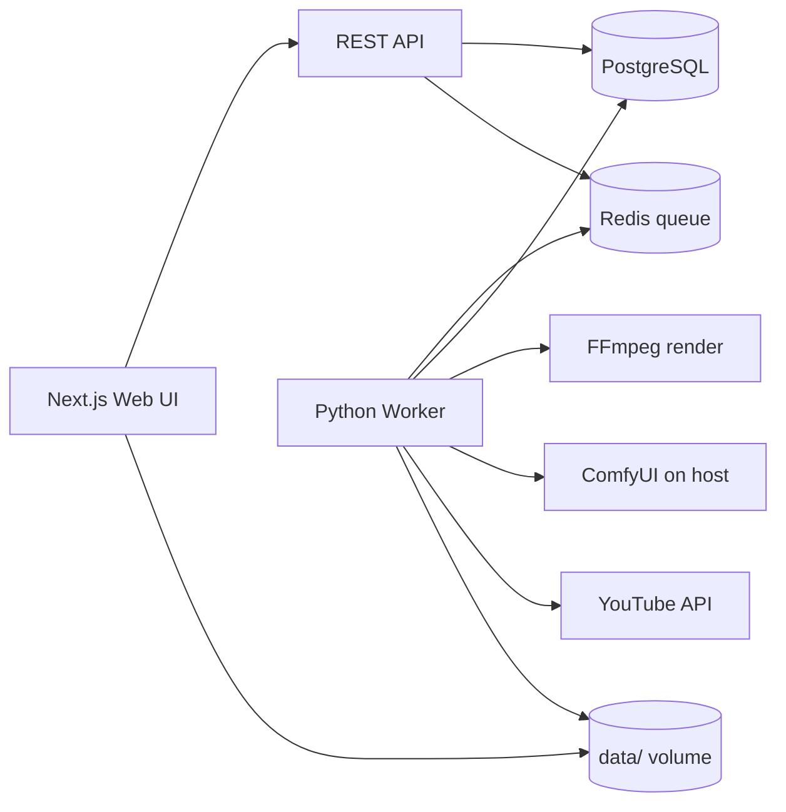

# SetMixer Generator

**Self-hosted YouTube video generator for DJ mixes** — waveform overlay, AI cover art, film effects, scheduled uploads.

Open-source tool for electronic music creators: turn long DJ sets (MP3/WAV/FLAC) into ready-to-publish YouTube videos with a Denon-style waveform, custom or AI-generated backgrounds, and one-click scheduling.

[](docker-compose.yml)
[](apps/web)
[](workers/python)
[](workers/python/renderer/waveform_video.py)
[](LICENSE)

---

## Возможности

| Функция | Описание |
|--------|----------|
| **Waveform (Denon)** | Прозрачная 3-band волна (bass · mid · highs) поверх обложки |
| **AI-обложки** | Локальная генерация через [ComfyUI](docs/COMFYUI_SETUP.md) (Flux SDXL / Klein), txt2img и img2img по референсу |
| **Библиотека обложек** | Глобальная коллекция фонов с поиском, переиспользование между миксами |
| **Текст на обложке** | Надпись с адаптивным цветом в верхней зоне (не перекрывает waveform) |
| **Видеоэффекты** | Film grain, VHS, 8mm, glitch, flicker и др. — только с движением по кадрам |
| **YouTube** | OAuth, загрузка, отложенная публикация по расписанию |
| **Локальный запуск** | Docker Compose на Windows / macOS / Linux, без VPS |

---

## Быстрый старт

### Требования

- [Docker Desktop](https://www.docker.com/products/docker-desktop/) (рекомендуется)
- ~4 GB RAM для контейнеров + место под миксы и рендеры
- Опционально: [ComfyUI](docs/COMFYUI_SETUP.md) на хосте для AI-обложек
- Опционально: Google Cloud проект для YouTube OAuth ([инструкция](docs/YOUTUBE_SETUP.md))

### 1. Клонировать и настроить

```powershell
git clone https://github.com/BobJustFry/setMixer-generator.git
cd setMixer-generator
copy .env.example .env
```

В `.env` для первого запуска достаточно значений по умолчанию. YouTube и ComfyUI настраиваются в веб-интерфейсе (**Настройки**).

### 2. Запустить

```powershell
docker compose up -d --build
```

Если PowerShell не находит `docker` после установки Docker Desktop — перезапустите IDE или используйте `.\scripts\compose.ps1 up -d --build`.

### 3. Открыть приложение

**http://localhost:3000**

### 4. Добавить миксы

Скопируйте аудио в `data/mixes/` → **Миксы** → **Сканировать** → **Создать видео**.

---

## Подключение сервисов

### ComfyUI (AI-обложки)

1. Установите и запустите [ComfyUI](https://github.com/comfyanonymous/ComfyUI) на компьютере (обычно `http://127.0.0.1:8000`).
2. Скачайте checkpoint, например `flux1-dev-fp8.safetensors` или Klein 4B (см. список моделей в **Настройки → ComfyUI**).
3. В SetMixer укажите:
   - **URL:** `http://host.docker.internal:8000` (worker в Docker обращается к ComfyUI на хосте)
   - **Checkpoint:** имя файла из папки `models/checkpoints/` или `models/unet/`
4. **Сохранить и проверить** — статус «Подключено».

Подробнее: [docs/COMFYUI_SETUP.md](docs/COMFYUI_SETUP.md)

Без ComfyUI можно загружать свои изображения или использовать тёмный/градиентный шаблон.

### YouTube OAuth

1. [Google Cloud Console](https://console.cloud.google.com/) → новый проект.
2. Включить [YouTube Data API v3](https://console.cloud.google.com/apis/library/youtube.googleapis.com).
3. OAuth consent screen → External, добавить scopes `youtube.upload` и `youtube.readonly`, **Test users** = ваш Google-email.
4. Credentials → OAuth Client ID → Web application:
   - **JavaScript origins:** `http://localhost:3000`
   - **Redirect URI:** `http://localhost:3000/api/youtube/callback`
5. В SetMixer: **Настройки → YouTube** → вставить Client ID и Secret (или JSON) → **Авторизоваться в Google**.

Origin и Redirect URI в форме настроек совпадают с Google Console — копируйте оттуда.

Подробнее: [docs/YOUTUBE_SETUP.md](docs/YOUTUBE_SETUP.md)

### Шифрование токенов (рекомендуется)

В **Настройки** или в `.env` задайте `ENCRYPTION_KEY` — случайная строка 32+ символов. Без неё OAuth-токены YouTube хранятся в открытом виде в БД.

---

## Workflow

```
Миксы (data/mixes)
    ↓ сканирование
Создать видео → выбор обложки / AI / эффекта / качества
    ↓ worker: waveform + рендер FFmpeg
Готовое MP4 (data/renders)
    ↓
Расписание → метаданные → отложенная публикация на YouTube
```

1. Положите файлы в `data/mixes`.
2. **Миксы** → **Сканировать** → **Создать видео**.
3. Выберите шаблон (тёмный / градиент / своя обложка), эффект, разрешение и битрейт.
4. Дождитесь этапов *Построение waveform* → *Кодирование видео* на странице задачи.
5. **Расписание** — заголовок, описание, теги, дата публикации.

---

## Архитектура



| Компонент | Назначение |
|-----------|------------|
| `apps/web` | Next.js 15 UI, API, Prisma, YouTube OAuth |
| `workers/python` | Очередь задач, librosa/FFmpeg, ComfyUI, upload |
| `postgres` | Миксы, задачи, обложки, настройки |
| `redis` | Очередь analyze / render / upload |

---

## Структура данных

| Путь | Содержимое |
|------|------------|
| `data/mixes/` | Исходные аудиофайлы |
| `data/renders/` | Готовые MP4 |
| `data/backgrounds/` | AI и загруженные обложки |
| `data/waveforms/` | PNG waveform (Denon 3-band) |
| `data/references/` | Референс-изображения для img2img |

Папки `data/*` не коммитятся в git — только локальные данные.

---

## Команды

```powershell
docker compose up -d --build   # сборка и запуск
docker compose logs -f worker  # логи рендера
docker compose down            # остановка
git pull && docker compose up -d --build  # обновление
```

Гибридный запуск (Postgres/Redis в Docker, web и worker локально): [docs/DEPLOY.md](docs/DEPLOY.md)

---

## Документация

- [Локальный деплой](docs/DEPLOY.md)
- [YouTube OAuth](docs/YOUTUBE_SETUP.md)
- [ComfyUI](docs/COMFYUI_SETUP.md)

---

## Стек

Next.js 15 · React 19 · Prisma · PostgreSQL · Redis · Python 3.12 · librosa · FFmpeg · ComfyUI · Google YouTube Data API · Docker Compose

---

## Поиск и теги

Репозиторий помечен темами: `youtube`, `dj-mix`, `video-generator`, `ffmpeg`, `waveform`, `comfyui`, `nextjs`, `docker`, `self-hosted`, `music-visualization`, `electronic-music`.

---

## Лицензия

[MIT](LICENSE) — используйте свободно, на свой риск. YouTube API и ComfyUI подчиняются своим условиям использования.
